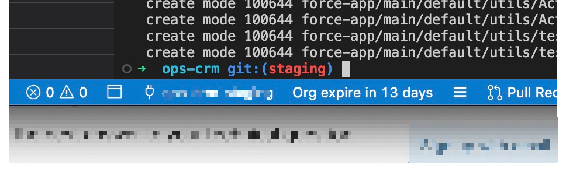

# status-so README

A simple VS code extension to display the number of days before a SO (Salesforce ScratchOrg) will expire.

## How to install

1. Git clone this repo to your local machine
2. Open the repo in VS Code
3. Open the terminal in VS Code
4. Make sure that you have `code` command installed in your terminal (CMD + SHIFT + P -> Shell Command: Install 'code' command in PATH)
5. Run `code --install-extension status-so-0.2.1.vsix`
6. Voila! You should see the extension installed in your VS Code!

